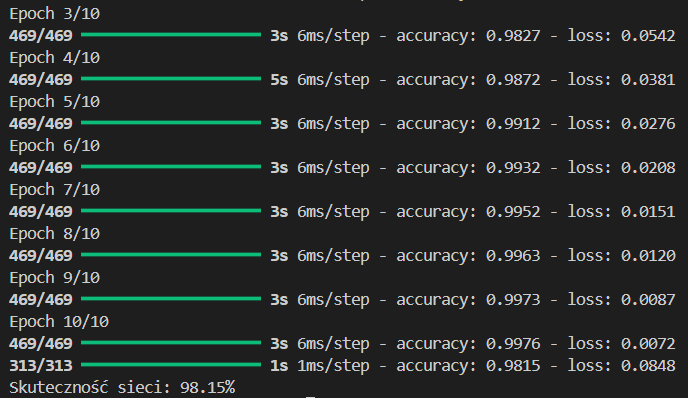
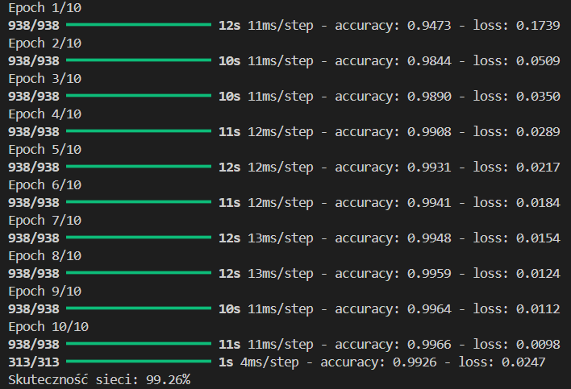

# 📝 MNIST Digit Recognition: MLP vs. CNN

This project is a practical comparison of two different neural network architectures for the task of classifying handwritten digits using the **MNIST** dataset. It demonstrates the evolution from a standard dense network (**Multilayer Perceptron**) to a more advanced **Convolutional Neural Network (CNN)**.

## 🚀 Project Overview

The goal of this project is to demonstrate the practical differences in implementation, data preparation, and performance between standard dense layers and convolutional layers using **TensorFlow/Keras**.

### 1. Dense Model (MLP)

The initial approach uses a classic feed-forward structure.

- **Preprocessing:** 2D images are "flattened" into 1D vectors of 784 pixels ($28 \times 28$).
- **Architecture:** Two fully connected (Dense) hidden layers with 512 and 256 neurons using `ReLU` activation.
- **Optimizer:** `RMSprop`.
- **Output:** 10 neurons with `Softmax` activation representing digits 0-9.

### 2. Convolutional Model (CNN)

The second part implements a spatial-aware architecture that preserves the 2D nature of images.

- **Preprocessing:** Data is reshaped to `(28, 28, 1)` to maintain spatial hierarchy.
- **Architecture:** \* 3 Convolutional layers (`Conv2D`) with 32 and 64 filters to extract visual features (edges, curves).
  - Max Pooling layers (`MaxPooling2D`) for spatial reduction and shift invariance.
  - A `Flatten` operation followed by a Dense classifier head.
- **Optimizer:** `Adam`.

## 📊 Performance Comparison

| Model Architecture      | Epochs | Batch Size | Test Accuracy |
| :---------------------- | :----: | :--------: | :-----------: |
| **Dense (MLP)**         |   10   |    128     |    ~98.1%     |
| **Convolutional (CNN)** |   10   |     64     |  **~99.2%**   |

<br>

**MLP results:**



**CNN results:**



**Key Finding:** The CNN model consistently outperforms the MLP by better understanding the spatial relationships between pixels, making it more robust to distortions.

## 🛠️ Tech Stack

- **Python 3**
- **TensorFlow / Keras** - Deep Learning framework.
- **NumPy** - Mathematical operations on arrays.

## 📖 How to Run

1. **Clone the repository:**
   ```bash
   git clone [https://github.com/Mr-TwisT/CNN-MNIST](https://github.com/Mr-TwisT/CNN-MNIST)
   ```
2. **Install dependencies:**
   ```bash
   pip install tensorflow numpy
   ```
3. **Run the script:**
   ```bash
   python MNIST-nn.py
   ```

## 🧠 Key Concepts Covered

- **Data Normalization:** Scaling pixel values to the [0, 1] range.
- **Convolutions & Pooling:** How "filters" extract features like edges and curves.
- **Softmax Activation:** Turning raw network outputs into interpretable percentages.
- **Flattening:** Bridging the gap between 2D feature maps and 1D classifiers.
